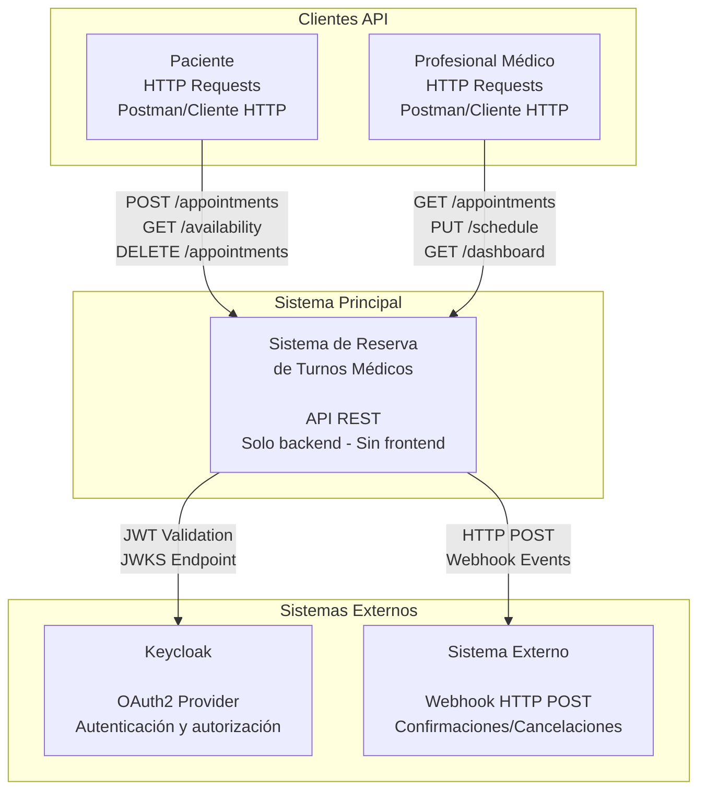
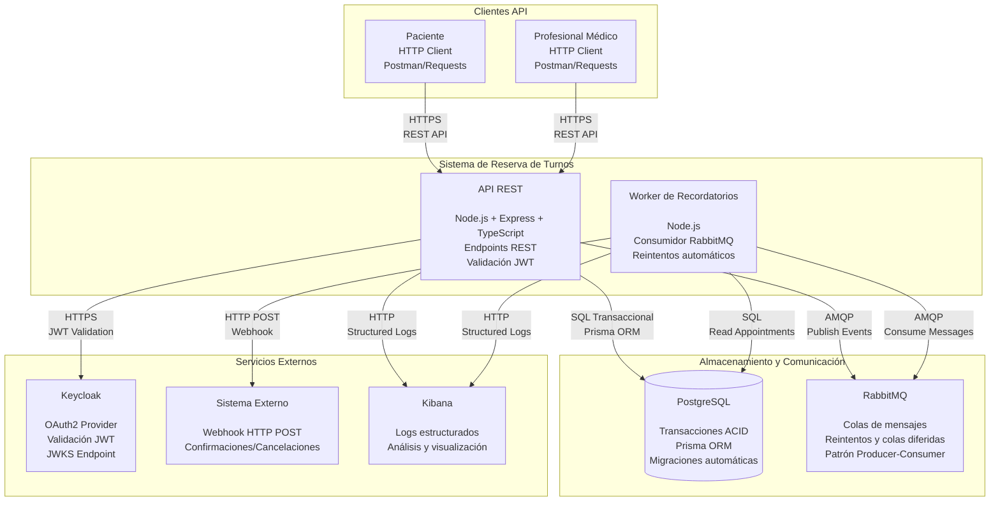
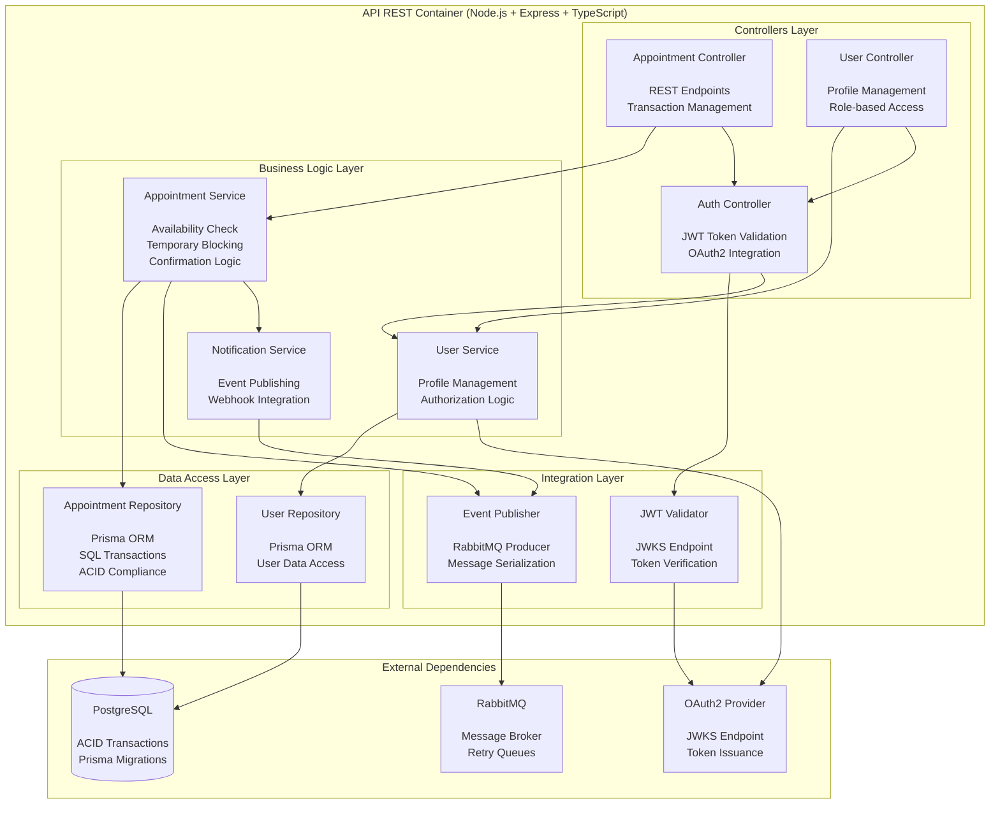
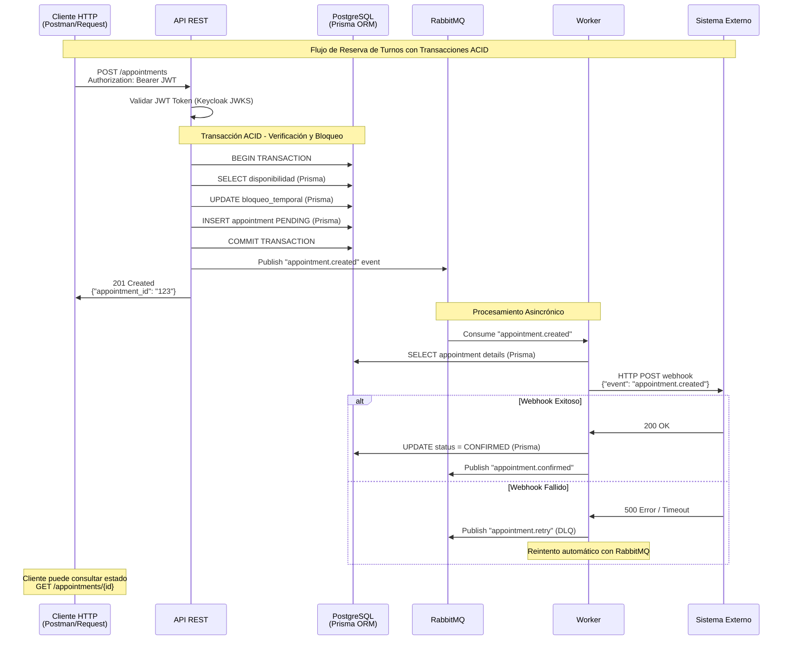
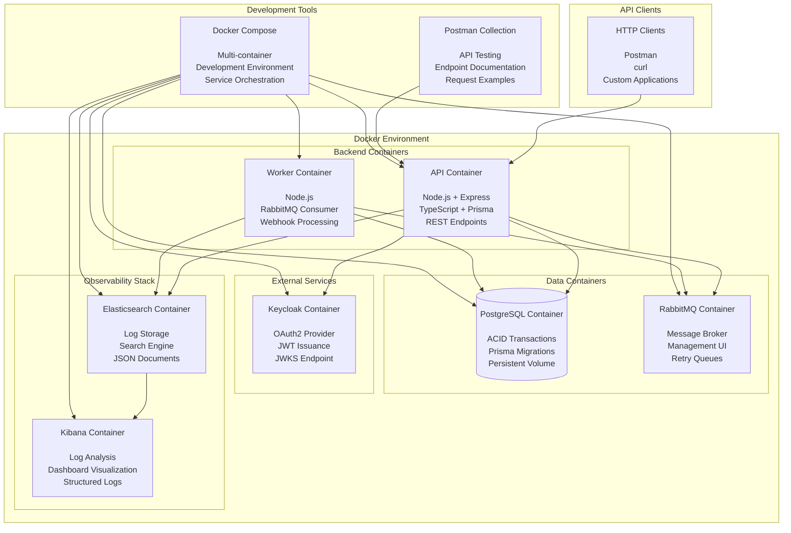

# 🏥 Sistema de Reserva de Turnos de Salud Ambulatoria

**Versión:** v1.0.0  
**Último commit:** `74f764579559bc38b7d08584239deecf29711097`

## 📘 Proyecto y Dominio

El proyecto consiste en el desarrollo de una **API REST** para la **gestión de reservas de turnos médicos ambulatorios**, permitiendo a los pacientes consultar la disponibilidad de profesionales, reservar turnos y recibir recordatorios automáticos.

**Scope del proyecto:** Solo desarrollo de APIs REST, sin frontend. Los clientes interactuarán mediante requests HTTP directos o herramientas como Postman.

El sistema contempla:
- **Entidades principales:** Paciente, Profesional (con agenda)
- **Transacción clave:** Reserva de turno (verificación de disponibilidad, bloqueo temporal y confirmación)
- **Asincronía:** Recordatorios automáticos con reintentos
- **Integración:** Webhook de confirmación/cancelación
- **Seguridad:** OAuth2 + JWT con Keycloak
- **Base de datos:** PostgreSQL con Prisma ORM
- **Comunicación asíncrona:** RabbitMQ
- **Contenedores:** Docker + Docker Compose
- **Observabilidad:** Logs estructurados con Kibana
- **Pruebas:** colección de Postman

## 📂 Arquitectura y documentación

- Los diagramas C4 (Niveles 1, 2, 3 y despliegue) están incluidos en este `README.md`.
- La documentación técnica y de setup detallado se encuentra en `SETUP.md`.
## Nivel 1: Contexto del Sistema

Este diagrama muestra el sistema de reserva de turnos médicos en su contexto más amplio, identificando los usuarios principales y los sistemas externos con los que interactúa.



## Nivel 2: Contenedores del Sistema

Este diagrama descompone el sistema en sus principales contenedores, mostrando las responsabilidades de cada uno y cómo se comunican entre sí según las decisiones arquitectónicas tomadas.



## Nivel 3: Componentes de la API

Este diagrama muestra los componentes internos del contenedor API REST, implementando las decisiones arquitectónicas definidas en los ADRs.



## Flujo de Transacción: Reserva de Turnos

Este diagrama muestra el flujo específico de la transacción clave del sistema - la reserva de turnos - implementando las decisiones arquitectónicas de transacciones ACID, eventos asincrónicos y webhooks.



## Arquitectura de Despliegue

Este diagrama muestra cómo se despliega el sistema usando Docker y Docker Compose, reflejando las decisiones de contenedores y observabilidad.



## 🔧 Requisitos y Setup Rápido

- Ver sección detallada en `SETUP.md`.
- Resumen mínimo:
  - Requisitos: Docker ≥ 24, Docker Compose ≥ 2.20, ~4GB RAM libre.
  - Levantar todo el entorno:
    ```bash
    docker-compose up -d
    ```
  - Servicios principales:
    - API: `http://localhost:3000/api`
    - Keycloak: `http://localhost:8080`
    - RabbitMQ UI: `http://localhost:15672`
    - Kibana: `http://localhost:5601`

## 🔐 Usuarios y credenciales de prueba

Ver también `SETUP.md` (sección “Credenciales por Defecto”).

- **Keycloak Admin Console**: `admin` / `admin` (realm `health_app`).
- **Usuario API de ejemplo**: `admin` / `admin` dentro del realm `health_app`.
- **PostgreSQL**: `health_app_user` / `health_app_password`.
- **RabbitMQ**: `health_app_user` / `health_app_password`.

## 🧪 Pruebas con Postman

- Importar colección: `Health_Appointments_API.postman_collection.json`.
- Flujo recomendado (ya preparado en la colección):
  1. **01 - Setup → Get Access Token**: obtiene y guarda `{{access_token}}`.
  2. **01 - Setup → Health Check**: verifica que la API responde.
  3. **02 - Get Data from Seed**: obtiene pacientes y profesionales del seed y guarda IDs.
  4. **03 - Create Appointment**: crea un turno usando esos IDs.
  5. **04 - Verify Appointment**: consulta el turno por ID y lista todos.

> Prueba de carga: no hay un escenario automático incluido (k6/JMeter), pero la colección Postman puede usarse como base para un test de carga externo (por ejemplo, ejecutándola con `newman` en loop).

## 👀 Observabilidad con Kibana

- URL de Kibana: `http://localhost:5601`.
- Índice de logs: `health-appointments-logs*` (crear una Data View con ese patrón y `@timestamp` como campo de tiempo).
- Campos útiles en Discover (añadir como columnas):
  - `origin` (por ejemplo: `"api"`, `"worker"`, `"rabbitmq"`).
  - `resource`, `operation` (para ver qué parte del dominio).
  - `appointmentId`, `patientId`, `professionalId`, `status`.
  - `statusCode`, `durationMs` (para requests HTTP).
- Ejemplos de filtros:
  - Errores HTTP:
    ```kql
    origin: "api" and statusCode >= 400
    ```
  - Flujo completo de un turno:
    ```kql
    appointmentId: "<ID_DEL_TURNO>"
    ```
  - Actividad del worker:
    ```kql
    origin: "worker"
    ```

## 🔄 Flujo asincrónico: cómo dispararlo y observarlo

1. Levantar el entorno con `docker-compose up -d`.
2. En Postman ejecutar:
   - `01 - Setup → Get Access Token`.
   - `02 - Get Data from Seed` (patients + professionals + availability).
   - `03 - Create Appointment`.
3. El servicio API publicará `appointment.created` en RabbitMQ.
4. El `worker` consumirá el mensaje, llamará al webhook y actualizará el estado del turno.
5. Para observar:
   - Ver el turno en `GET /appointments/{id}` (colección Postman “04 - Verify Appointment”).
   - Ver los logs del worker y de la API en Kibana filtrando por `appointmentId` o `origin: "worker"`.

## 🌐 Integración vía Webhook (sistema externo)

- El sistema externo se simula mediante la variable `WEBHOOK_URL`:
  - Por defecto: `WEBHOOK_URL=http://httpbin.org/post` (en `env.example` y `docker-compose.yml`).
  - Podés cambiar `WEBHOOK_URL` a cualquier endpoint HTTP que tengas localmente (otro servicio, mock, ngrok, etc.).
- Cada vez que se crea un turno (`appointment.created`), el worker enviará un `POST` al `WEBHOOK_URL` con un payload JSON.
- Para debug:
  - Con `httpbin`, podés ver el cuerpo recibido en la respuesta de `httpbin.org`.
  - En Kibana, filtrá por `origin: "worker"` para ver los logs de envío/reintento de webhooks.

## ⚠️ Limitaciones actuales y mejoras futuras

- **Limitaciones:**
  - Solo backend API, sin frontend (toda la interacción es vía HTTP/Postman).
  - No hay pruebas de carga automatizadas incluidas (solo colección funcional).
  - No se incluye métricas APM ni dashboards avanzados de p95/throughput/error-rate (solo logs estructurados).
- **Posibles mejoras futuras:**
  - Agregar un escenario de carga (k6/Newman) y reportes automatizados.
  - Incorporar métricas (Prometheus/Grafana) y dashboards específicos de rendimiento.
  - Añadir más validaciones de dominio y flujos adicionales (recordatorios por email/SMS, etc.).

🧩 ADRs – Architectural Decision Records
🧾 ADR 1: Estilo de comunicación – REST API

Decisión: Se elige REST sobre gRPC.
Motivo:

Simplicidad para clientes web y móviles.

Soporte nativo en herramientas de prueba (Postman).

Menor curva de aprendizaje.
Consecuencia:

Las integraciones asincrónicas (recordatorios) usarán eventos y no RPCs.

🧾 ADR 2: Base de datos – PostgreSQL + Prisma ORM

Decisión: Se usa PostgreSQL como base de datos principal con Prisma ORM.
Motivo:

Soporte para transacciones ACID (necesario en reservas).

Prisma ORM: Generación automática de tipos TypeScript, migraciones automáticas, cliente type-safe.

Facilidad para manejar seeds y migraciones con Prisma CLI.

Consecuencia:

Datos estructurados y consistentes; Prisma maneja la normalización automáticamente.

Desarrollo más rápido con tipos automáticos y validaciones.

🧾 ADR 3: Asincronía – RabbitMQ

Decisión: Se elige RabbitMQ como broker de mensajería.
Motivo:

Modelo productor–consumidor simple.

Soporte nativo para reintentos y colas diferidas.

Amplio soporte en Node.js.
Consecuencia:

El microservicio de recordatorios consumirá mensajes desde RabbitMQ.

🧾 ADR 4: Seguridad – Keycloak + OAuth2 + JWT

Decisión: Autenticación mediante Keycloak como proveedor OAuth2 con tokens JWT.
Motivo:

Keycloak: Solución completa de gestión de identidad y acceso (IAM).

Integración estándar OAuth2 con JWKS endpoint para validación de tokens.

Tokens JWT firmados que permiten validación sin consultas adicionales a la BD.

Consecuencia:

Los endpoints protegidos requerirán validación de tokens JWT contra JWKS de Keycloak.

Desarrollo simplificado sin necesidad de implementar autenticación propia.

🧾 ADR 5: Integración – Webhook HTTP POST

Decisión: Implementar integración mediante Webhooks HTTP POST.
Motivo:

Comunicación simple con sistemas externos (notificaciones, confirmaciones).

Evita mantener conexiones persistentes como WebSocket.

Patrón estándar para integraciones asíncronas.
Consecuencia:

Los eventos de confirmación/cancelación se enviarán por HTTP POST.

El Worker procesará los webhooks con reintentos automáticos via RabbitMQ.

🧾 ADR 6: Observabilidad – Kibana + Elasticsearch

Decisión: Usar Kibana + Elasticsearch para logs estructurados.
Motivo:

Kibana: Herramienta conocida para análisis y visualización de logs.

Elasticsearch: Motor de búsqueda robusto para logs estructurados JSON.

Integración nativa entre Kibana y Elasticsearch.

Consecuencia:

Logs estructurados en formato JSON enviados a Elasticsearch.

Dashboards y análisis de logs mediante Kibana.

🧾 ADR 7: Scope del Proyecto – Solo Backend API

Decisión: Desarrollo únicamente de APIs REST, sin frontend.
Motivo:

Enfoque específico en la lógica de negocio y arquitectura backend.

Simplificación del desarrollo y testing.

Los clientes interactuarán mediante HTTP requests directos o Postman.
Consecuencia:

No se desarrollará interfaz de usuario.

Toda la interacción será mediante endpoints REST documentados.

Testing mediante colección de Postman.