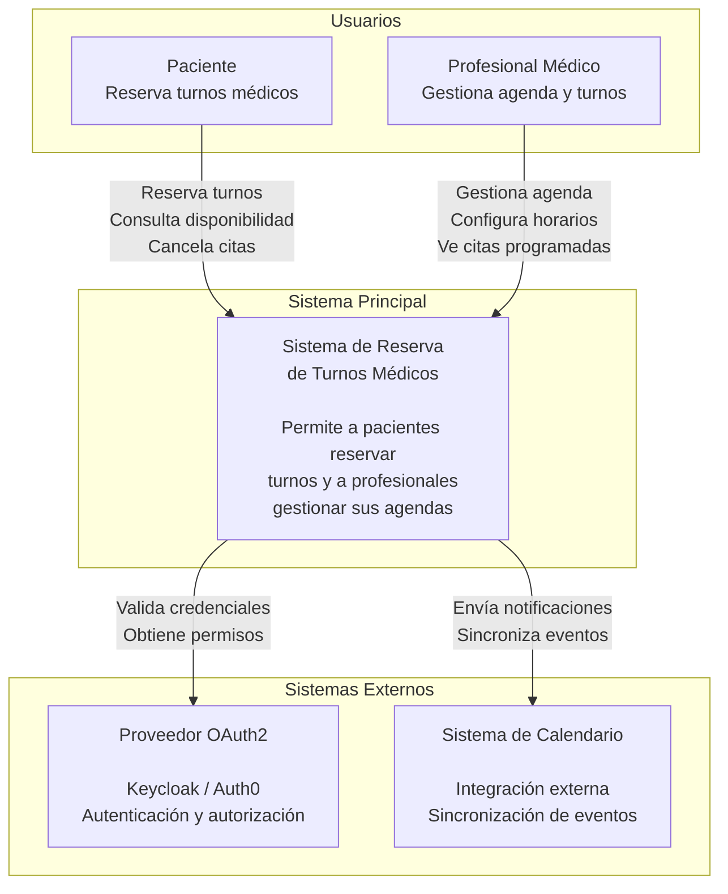
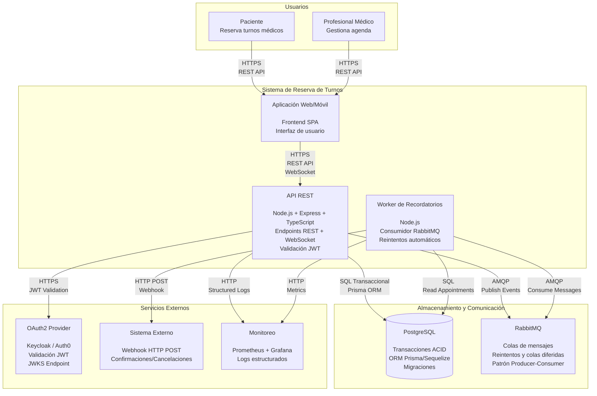
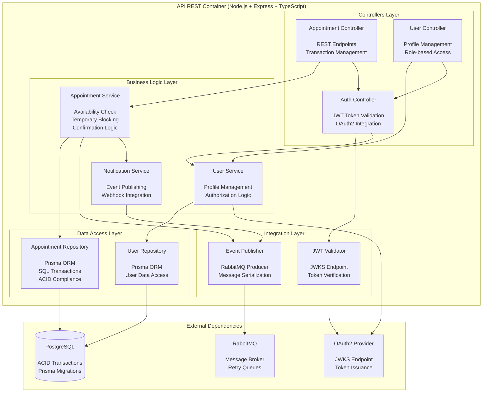
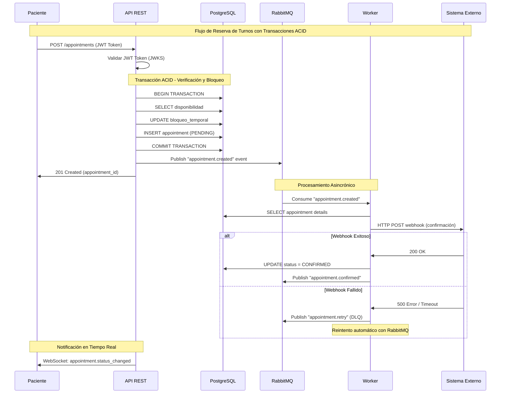
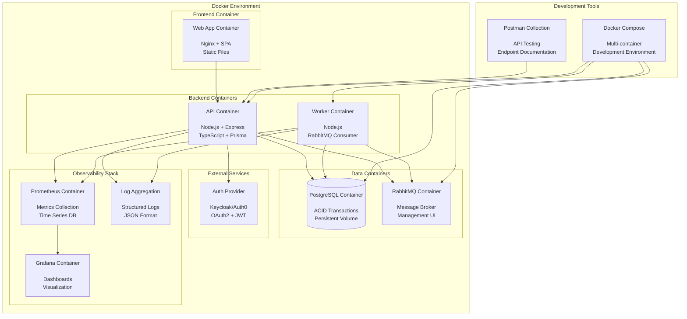

# 🏥 Sistema de Reserva de Turnos de Salud Ambulatoria

## 📘 Proyecto y Dominio

El proyecto consiste en el desarrollo de una **API REST** para la **gestión de reservas de turnos médicos ambulatorios**, permitiendo a los pacientes consultar la disponibilidad de profesionales, reservar turnos y recibir recordatorios automáticos.

El sistema contempla:
- **Entidades principales:** Paciente, Profesional (con agenda)
- **Transacción clave:** Reserva de turno (verificación de disponibilidad, bloqueo temporal y confirmación)
- **Asincronía:** Recordatorios automáticos con reintentos
- **Integración:** Webhook de confirmación/cancelación o tablero en vivo vía WebSocket
- **Seguridad:** OAuth2 + JWT
- **Contenedores:** Docker + Docker Compose
- **Observabilidad:** logs estructurados y métricas básicas
- **Pruebas:** colección de Postman
## Nivel 1: Contexto del Sistema

Este diagrama muestra el sistema de reserva de turnos médicos en su contexto más amplio, identificando los usuarios principales y los sistemas externos con los que interactúa.

## Nivel 2: Contenedores del Sistema

Este diagrama descompone el sistema en sus principales contenedores, mostrando las responsabilidades de cada uno y cómo se comunican entre sí según las decisiones arquitectónicas tomadas.

## Nivel 3: Componentes de la API

Este diagrama muestra los componentes internos del contenedor API REST, implementando las decisiones arquitectónicas definidas en los ADRs.

## Flujo de Transacción: Reserva de Turnos

Este diagrama muestra el flujo específico de la transacción clave del sistema - la reserva de turnos - implementando las decisiones arquitectónicas de transacciones ACID, eventos asincrónicos y webhooks.

## Arquitectura de Despliegue

Este diagrama muestra cómo se despliega el sistema usando Docker y Docker Compose, reflejando las decisiones de contenedores y observabilidad.

🧩 ADRs – Architectural Decision Records
🧾 ADR 1: Estilo de comunicación – REST API

Decisión: Se elige REST sobre gRPC.
Motivo:

Simplicidad para clientes web y móviles.

Soporte nativo en herramientas de prueba (Postman).

Menor curva de aprendizaje.
Consecuencia:

Las integraciones asincrónicas (recordatorios) usarán eventos y no RPCs.

🧾 ADR 2: Base de datos – PostgreSQL (SQL)

Decisión: Se usa PostgreSQL como base de datos principal.
Motivo:

Soporte para transacciones (necesario en reservas).

Amplio soporte ORM (Prisma, Sequelize).

Facilidad para manejar seeds y migraciones.
Consecuencia:

Datos estructurados y consistentes; se requerirá normalización adecuada.

🧾 ADR 3: Asincronía – RabbitMQ

Decisión: Se elige RabbitMQ como broker de mensajería.
Motivo:

Modelo productor–consumidor simple.

Soporte nativo para reintentos y colas diferidas.

Amplio soporte en Node.js.
Consecuencia:

El microservicio de recordatorios consumirá mensajes desde RabbitMQ.

🧾 ADR 4: Seguridad – OAuth2 + JWT

Decisión: Autenticación mediante OAuth2 con tokens JWT.
Motivo:

Integración estándar con terceros (Google, Auth0, Keycloak).

Tokens firmados que permiten validación sin consultas adicionales.
Consecuencia:

Los endpoints protegidos requerirán validación de tokens JWT.

🧾 ADR 5: Integración – Webhook

Decisión: Implementar integración mediante Webhooks.
Motivo:

Comunicación simple con sistemas externos (notificaciones, confirmaciones).

Evita mantener conexiones persistentes como WebSocket.
Consecuencia:

Los eventos de confirmación/cancelación se enviarán por HTTP POST.